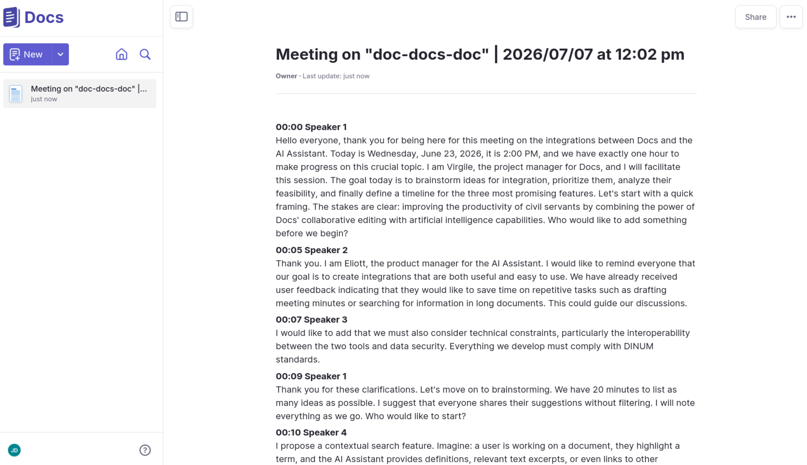

<p align="center">
  <a href="https://github.com/suitenumerique/docs">
    
  </a>
</p>

<p align="center">
  <a href="https://github.com/suitenumerique/docs/stargazers/">
    
  </a>
  <a href="https://github.com/suitenumerique/docs/blob/main/CONTRIBUTING.md">
    
  </a>
  <a href="https://github.com/suitenumerique/docs/blob/main/LICENSE">
    
  </a>
  <a href="https://snyk.io/test/github/suitenumerique/docs">
    
  </a>
  <a href="https://digitalpublicgoods.net/r/docs-collaborative-text-editing">
    
  </a>
</p>

<p align="center">
  <a href="https://matrix.to/#/#docs-official:matrix.org">Chat on Matrix</a> •
  <a href="documentation/">Documentation</a> •
  <a href="#try-docs">Try Docs</a> •
  <a href="mailto:docs@numerique.gouv.fr">Contact us</a>
</p>

# La Suite Docs: Collaborative Text Editing

**Docs, where your notes can become knowledge through live collaboration.**

Docs is an open-source collaborative editor that helps teams write, organize, and share knowledge together - in real time.


## What is Docs?

Docs is an open-source alternative to tools like Notion or Google Docs, focused on:

- Real-time collaboration
- Clean, structured documents
- Knowledge organization
- Data ownership & self-hosting

***Built for public organizations, companies, and open communities.***

## Why use Docs?

### Writing

- Rich-text & Markdown editing
- Slash commands & block system
- Beautiful formatting
- Offline editing
- Optional AI writing helpers (rewrite, summarize, translate, fix typos)

### Collaboration

- Live cursors & presence
- Comments & sharing
- Granular access control

### Knowledge management

- Subpages & hierarchy
- Searchable content

### Presentations

- Simple structure, based on delimiter (`---`)
- Full screen option
- PDF exports
- Keyboard navigation
- Start presention from a block
- Presentation link


### Export/Import

- Import to `.docx` and `.md`
- Export to `.docx`, `.odt`, `.pdf`

### AI features
Docs has optional AI features. 
They're model agnostic and gateway agnostic.
You can either run your own or just use your AI provider. 
The config only requires an API key and a URL.

#### V1: You select, AI replaces 
This version features a simple select and replace workflow. 
Your selection is the context and the instruction for the model. 
The AI feedback replaces your selection and is designed is optimized for Docs formatting.


#### V2: AI toolbar, AI cursor (beta)
This version uses [BlockNote AI integration](https://www.blocknotejs.org/docs/features/ai). It features: 
- an AI toolbar at selection in which you can prompt, accept, reject and iterate AI feedback
- an AI cursor, which interacts with the document, just as another collaborator in your document
- document context is used on top of the selection


### Interoperability
Docs comes with a [resource server API](documentation/resource_server.md) and a [server to server API](https://github.com/suitenumerique/docs/blob/c647cb62f1cbf1af9841ae8cb3818e34bb566c9c/documentation/env.md#L76-L77) which allows for awesome integrations.

#### A concrete example: [Meet](https://github.com/suitenumerique/meet/)'s transcriptions
If you're running a Meet instance, with simple config (`DJANGO_SERVER_TO_SERVER_API_TOKENS`) you can push your meeting transcript to Docs and give access to the user who requested it.



## Try Docs

Experience Docs instantly - no installation required.

- 🔗 [Open a live demo document][demo]
- 🌍 [Browse public instances][instances]

[demo]: https://demo.docs.la-suite.eu/docs/6d1b6f7f-db33-4673-9277-4bf47b9881ec/
[instances]: documentation/instances.md

## Self-hosting

Docs supports Kubernetes, Docker Compose, and community-provided methods such as Nix and YunoHost.

Get started with self-hosting: [Installation guide](documentation/installation/README.md)

> [!WARNING]
> Some advanced features (for example: `Export as PDF`) rely on XL packages from Blocknote.
> These packages are licensed under GPL and are **not MIT-compatible**
>
> You can run Docs **without these packages** by building with:
>
> ```bash
> PUBLISH_AS_MIT=true
> ```
>
> This builds an image of Docs without non-MIT features.
>
> More details can be found in [environment variables](documentation/env.md)

## Local Development (for contributors)

Run Docs locally for development and testing.

> [!WARNING]
> This setup is intended **for development and testing only**.
> It uses Minio as an S3-compatible storage backend, but any S3-compatible service can be used.

### Prerequisites

- Docker
- Docker Compose
- GNU Make

Verify installation:

```bash
docker -v
docker compose version
```

> If you encounter permission errors, you may need to use `sudo`, or add your user to the `docker` group.

### Bootstrap the project

The easiest way to start is using GNU Make:

```bash
make bootstrap FLUSH_ARGS='--no-input'
```

This builds the `app-dev` and `frontend-dev` containers, installs dependencies, runs database migrations, and compiles translations.

It is recommended to run this command after pulling new code.

Start services:

```bash
make run
```

Open <https://localhost:3000>

Default credentials (development only):

```md
username: impress
password: impress
```

### Frontend development mode

For frontend work, running outside Docker is often more convenient:

```bash
make frontend-development-install
make run-frontend-development
```

### Backend only

Starting all services except the frontend container:

```bash
make run-backend
```

### Tests & Linting

```bash
make frontend-test
make frontend-lint
```

Backend tests can be run without docker. This is useful to configure PyCharm or VSCode to do it. 
Removing docker for testing requires to overwrite some URL and port values that are different in and out of 
Docker. `env.d/development/common` contains all variables, some of them having to be overwritten by those in
`env.d/development/common.test`.

### Demo content

Create a basic demo site:

```bash
make demo
```

### More Make targets

To check all available Make rules:

```bash
make help
```

### Django admin

Create a superuser:

```bash
make superuser
```

Admin UI: <http://localhost:8071/admin>

## Contributing

This project is community-driven and PRs are welcome.

- [Contribution guide](CONTRIBUTING.md)
- [Translations](https://crowdin.com/project/lasuite-docs)
- [Chat with us!](https://matrix.to/#/#docs-official:matrix.org)

## Roadmap

Curious where Docs is headed?

Explore upcoming features, priorities and long-term direction on our [public roadmap](https://docs.numerique.gouv.fr/docs/d1d3788e-c619-41ff-abe8-2d079da2f084/).

## License 📝

This work is released under the MIT License (see [LICENSE](https://github.com/suitenumerique/docs/blob/main/LICENSE)).

While Docs is a public-driven initiative, our license choice is an invitation for private sector actors to use, sell and contribute to the project.

## Credits ❤️

### Stack

Docs is built on top of [Django Rest Framework](https://www.django-rest-framework.org/), [Next.js](https://nextjs.org/), [ProseMirror](https://prosemirror.net/), [BlockNote.js](https://www.blocknotejs.org/), [HocusPocus](https://tiptap.dev/docs/hocuspocus/introduction), and [Yjs](https://yjs.dev/). We thank the contributors of all these projects for their awesome work!

We are proud sponsors of [BlockNotejs](https://www.blocknotejs.org/) and [Yjs](https://yjs.dev/).

---

### Gov ❤️ open source

Docs is the result of a joint initiative led by the French 🇫🇷 ([DINUM](https://www.numerique.gouv.fr/dinum/)) Government and German 🇩🇪 government ([ZenDiS](https://zendis.de/)).

We are always looking for new public partners (we are currently onboarding the Netherlands 🇳🇱), feel free to [contact us](mailto:docs@numerique.gouv.fr) if you are interested in using or contributing to Docs.

<p align="center">
  
</p>
