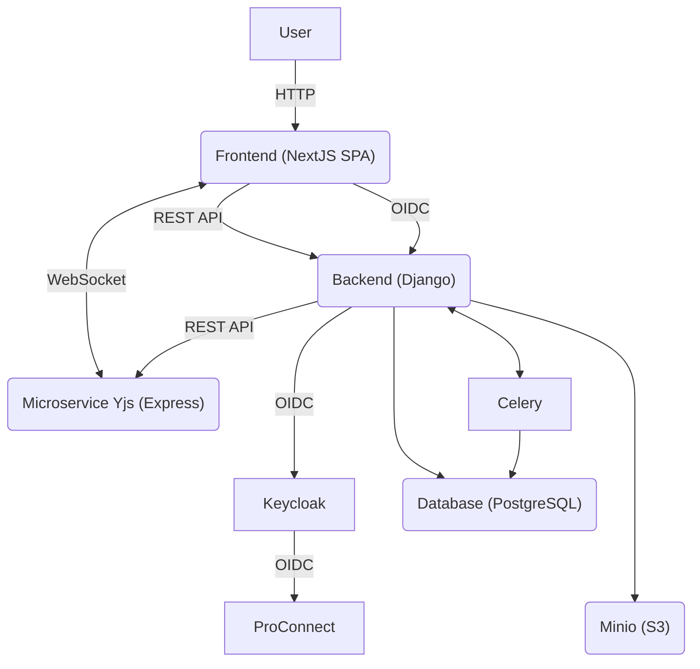

## Architecture

### Global system architecture

```mermaid
flowchart TD
    User -- HTTP --> Front("Frontend (NextJS SPA)")
    Front -- REST API --> Back("Backend (Django)")
    Front <-- WebSocket --> Yserver("Microservice Yjs (Express)")
    Front -- OIDC --> Back -- OIDC ---> Keycloak
    Back -- REST API --> Yserver
    Back --> DB("Database (PostgreSQL)")
    Back <--> Celery --> DB
    Back ----> S3("Minio (S3)")
    Keycloak -- OIDC --> ProConnect
```
