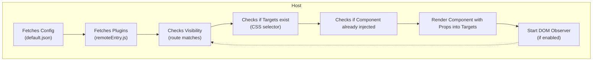

## Overview

The plugin system allows developers to extend the application's functionality and appearance without modifying the core. It's ideal for teams or third parties to add custom features.

### Glossary
- **Remote**: An application exposing components via module federation.
- **Host**: The main entry point application. This is Docs itself ("impress")
- **Plugin**: A remote module integrated into the host to provide UI components.
- **Module Federation**: Technology for runtime module sharing between apps.
- **Container**: Environment executing a remote module.
- **Exposed Module**: A module or component made available by a remote.

### Features and Limitations
**Features:**
- Add new UI components.
- Reuse host UI components.
- Dynamically inject via CSS selectors and config.
- Integrate without rebuilding or redeploying the host.
- Build and version plugins independently.

**Limitations:**
- Primarily for UI additions/modifications.
- Libraries used, that the host already provides, should match host versions to allow singleton behavior.
- Cannot extend Next.js-specific features like pages.
- No direct access to host state (only few exceptions where a global intermediary cache is used e.g. react-queries).
- Host updates may require plugin checks/updates for DOM/component changes (usually minimal).

### Overview
This diagram shows the plugin integration flow: fetching config and plugins, checking visibility, starting DOM observation, conditionally rendering components, and re-checking on DOM changes.





## Configuration

Plugins are configured via a JSON file (e.g., `impress/configuration/plugins/default.json`) loaded at runtime by the host. Place it in the backend, via a Docker volume for single-file drop-in or Kubernetes ConfigMap.

### Structure
| Field       | Type    | Required | Description |
|-------------|---------|----------|-------------|
| `id`       | String | Yes     | Unique component identifier (e.g., "my-widget"). |
| `remote`   | Object | Yes     | Remote module details. |
|   - `url`  | String | Yes     | Path to `remoteEntry.js` (absolute/relative). |
|   - `name` | String | Yes     | Federation remote name (e.g., "myPlugin"). |
|   - `module` | String | Yes   | Exposed module (e.g., "./Widget"). |
| `injection`| Object | Yes     | Integration control. |
|   - `target` | String | Yes   | CSS selector for insertion point. |
|   - `position` | String | No (default: "append") | Insertion position (`before`, `after`, `replace`, `prepend`, `append`). |
|   - `observerRoots` | String/Boolean | No | DOM observation: CSS selector, `true` (full page), `false` (none). |
| `props`    | Object | No      | Props passed to the plugin component. |
| `visibility` | Object | No    | Visibility controls. |
|   - `routes` | Array  | No     | Path globs (e.g., ["/docs/*", "!/docs/secret*"]); supports negation (`!`). |


### Example
```json
{
  "id": "my-custom-component-1",
  "remote": {
    "url": "localhost:3001/remoteEntry.js",
    "name": "my-plugin",
    "module": "./MyCustomComponent"
  },
  "injection": {
    "target": "#list #item3",
    "position": "append",
    "observerRoots": "#list"
  },
  "props": {
    "title": "My Widget",
    "color": "#ffcc00"
  },
  "visibility": {
    "routes": ["/docs/*", "!/docs/secret*"]
  }
}
```

### Key Notes
- `remote` and `injection` are required.
    - `remote.url` can be relative if the plugins compiled `remoteEntry.js` is placed in the hosts public folder (e.g. via k8s ConfigMap)
      ```diff
      - "url": "http://localhost:3001/remoteEntry.js",
      + "url": "/plugins/my-plugin/remoteEntry.js",
      ```
- Use `target`/`position` for flexible placement (e.g., replace or append).
- `observerRoots` enables re-injection if target lost through DOM changes<br>(e.g., components re-rendering/un-mounting)<br>It should be a selector to the closest stable ancestor<br>(e.g. `"#list"` if list is a dynamically populated container).
- Restrict visibility with `routes` globs and negations.
- Pass custom data via `props`.


#### `injection.position`

Below are simple examples for all possible values.<br>
Each shows the relevant JSON config and the resulting HTML structure after injection:


**before**
```json
{
  "injection": {
    "target": "#list #item3",
    "position": "before",
    "observerRoots": "#list"
  }
}
```
```html
<ul id="list">
  <li id="item1"></li>
  <li id="item2"></li>
  <div id="plugin-container-my-custom-component-0"></div>
  <li id="item3"></li>
</ul>
```

**after**
```json
{
  "injection": {
    "target": "#list #item1",
    "position": "after",
    "observerRoots": "#list"
  }
}
```
```html
<ul id="list">
  <li id="item1"></li>
  <div id="plugin-container-my-custom-component-0"></div>
  <li id="item2"></li>
  <li id="item3"></li>
</ul>
```

**prepend**
```json
{
  "injection": {
    "target": "#list",
    "position": "prepend",
    "observerRoots": "#list"
  }
}
```
```html
<ul id="list">
  <div id="plugin-container-my-custom-component-0"></div>
  <li id="item1"></li>
  <li id="item2"></li>
  <li id="item3"></li>
</ul>
```

**append**
```json
{
  "injection": {
    "target": "#list",
    "position": "append",
    "observerRoots": "#list"
  }
}
```
```html
<ul id="list">
  <li id="item1"></li>
  <li id="item2"></li>
  <li id="item3"></li>
  <div id="plugin-container-my-custom-component-0"></div>
</ul>
```

**replace**
```json
{
  "injection": {
    "target": "#list #item2",
    "position": "replace",
    "observerRoots": "#list"
  }
}
```
```html
<ul id="list">
  <li id="item1"></li>
  <div id="plugin-container-my-custom-component-0"></div>
  <li id="item2" data-pluginsystem-hidden="true"></li>
  <li id="item3"></li>
</ul>
```


## Development Guide

### Environment Variables
Set `NEXT_PUBLIC_DEVELOP_PLUGINS=true` in `.env.development` for debug logs, type-sharing, and hot-reload support. This also logs all exposed modules with exact versions on startup, helping match plugin dependencies.

### Type-Sharing for Intellisense
In plugin `tsconfig.json`:
```json
{
  "baseUrl": ".",
  "paths": {
    "*": ["./@mf-types/*"]
  }
}
```
Types update on build for compatibility and autocompletion.

### Exports Support
The host automatically exposes components and some features under the same structure that is used in docs code.

```typescript
// Direct import
import { useAuthQuery } from 'impress/features/auth/api/useAuthQuery';
import { Icon } from 'impress/components/Icon';

// Clean barrel export import
import { useAuthQuery } from 'impress/features/auth/api';
import { Icon } from 'impress/components';
```

**Important Notes:**
- Only barrel exports with runtime values are exposed (not type-only exports)
- In case of naming conflicts (e.g., `Button.tsx` and `Button/index.tsx`), explicit files take precedence over barrel exports
- The host logs warnings for any naming conflicts during build

### Recommended Workflow
2. Enable NEXT_PUBLIC_DEVELOP_PLUGINS and start host(docs) & plugin dev servers in parallel.
3. Configure federation in plugin `webpack.config.js` and expose components (see Examples).
4. Develop with hot-reload; use host components via shared types.
5. Test in host via config; debug with logs.
6. Version and deploy independently.

### Integration in Host
1. Build plugin and host `remoteEntry.js`.
2. Add to host config JSON.
3. Start host; plugin loads at runtime.
4. Verify via `[PluginSystem]` logs.

### Debugging
Enable `NEXT_PUBLIC_DEVELOP_PLUGINS=true` for console logs like `[PluginSystem] ...`.

Common Errors:
| Issue                  | Cause/Fix |
|------------------------|-----------|
| Unreachable `remoteEntry.js` | Check URL; ensure accessible. |
| Library version conflicts | Match React/etc. versions; use singletons in federation. |
| Invalid CSS selectors | Validate `target` against host DOM. |
| Type mismatches       | Update shared types on build. |

Errors are isolated via host ErrorBoundary.

## Best Practices and Security

### Best Practices
- Keep components modular and self-contained.
- Use props for flexibility/reusability.
- Document interfaces and expected props.
- Version plugins for host compatibility.
- Avoid internal host dependencies; use official types/components.
- Test regularly in host; monitor logs.
- Update federation config with host changes.

### Security and Isolation
- Plugins run isolated with ErrorBoundaries; errors don't crash host.
- No direct host state access; use interfaces/props.
- Vet third-party libraries for security.
- Check plugin functionality after host updates.
- Avoid unsafe external scripts/resources.

## Examples

### Federation Configuration (webpack.config.js)
Define `moduleFederationConfig` first for reuse:

```js
const { ModuleFederationPlugin } = require('webpack').container;
const NativeFederationTypeScriptHost = require('@module-federation/native-federation-typescript/host');

const moduleFederationConfig = {
  name: 'my-plugin',
  filename: 'remoteEntry.js',
  exposes: {
    './MyCustomComponent': './src/MyCustomComponent.tsx',
  },
  remotes: {
    impress: 'impress@http://localhost:3000/_next/static/chunks/remoteEntry.js',
  },
  shared: {
    react: { singleton: true },
    'react-dom': { singleton: true },
    'styled-components': { singleton: true },
    'cunningham-react': { singleton: true },
  },
};

module.exports = {
  plugins: [
    new ModuleFederationPlugin(moduleFederationConfig),
    ...(dev ? [NativeFederationTypeScriptHost({ moduleFederationConfig })] : []),
  ]
};
```
Adjust names/paths; declare shared libs as singletons. Use relative remotes if the plugin `remoteEntry.js` lives in host's public folder (e.g., public/plugins/my-plugin/remoteEntry.js).
```diff
- impress: 'impress@localhost:3000/_next/static/chunks/remoteEntry.js'
+ impress: 'impress@/_next/static/chunks/remoteEntry.js',
```

For plugin config example, see Configuration section.

## Summary
The plugin system enables runtime frontend extensions via module federation, with easy config, type-sharing, and independent deployment. Focus on UI mods, match versions, and test for compatibility. Use the diagram, tables, and examples for quick reference.