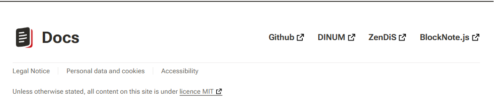
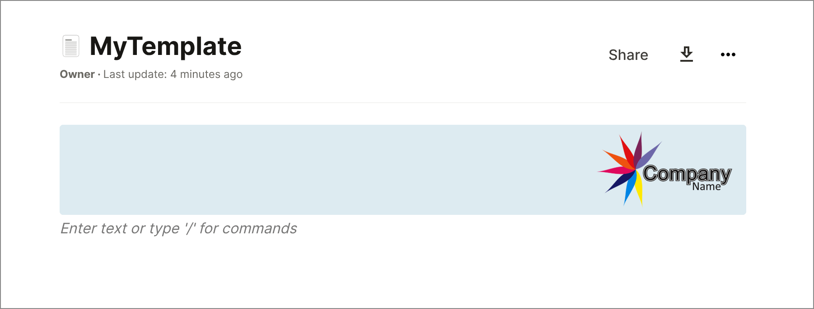
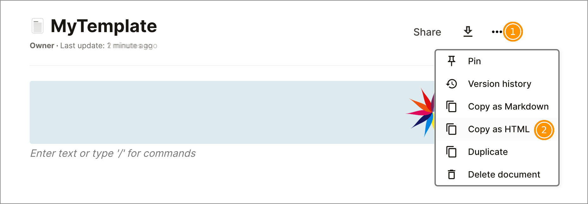
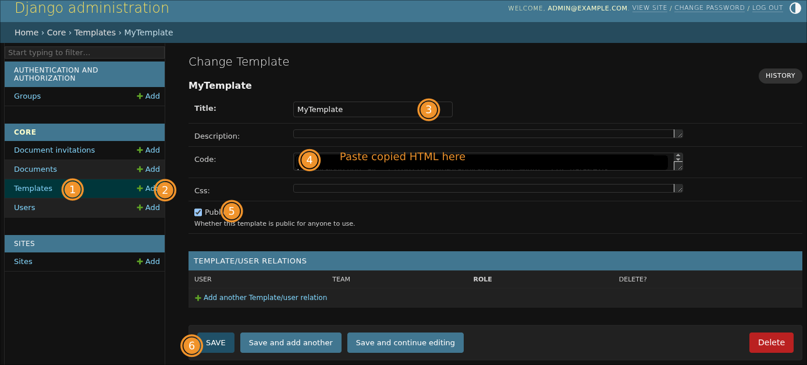

# Runtime Theming 🎨

### How to Use

To use this feature, simply set the `FRONTEND_CSS_URL` environment variable to the URL of your custom CSS file. For example:

```javascript
FRONTEND_CSS_URL=http://anything/custom-style.css
```

Once you've set this variable, Docs will load your custom CSS file and apply the styles to our frontend application.

### Benefits

This feature provides several benefits, including:

*   **Easy customization** 🔄: With this feature, you can easily customize the look and feel of our application without requiring any code changes.
*   **Flexibility** 🌈: You can use any CSS styles you like to create a custom theme that meets your needs.
*   **Runtime theming** ⏱️: This feature allows you to change the theme of our application at runtime, without requiring a restart or recompilation.

### Example Use Case

Let's say you want to change the background color of our application to a custom color. You can create a custom CSS file with the following contents:

```css
body {
  background-color: #3498db;
}
```

Then, set the `FRONTEND_CSS_URL` environment variable to the URL of your custom CSS file. Once you've done this, our application will load your custom CSS file and apply the styles, changing the background color to the custom color you specified.

----

# Runtime JavaScript Injection 🚀

### How to Use

To use this feature, simply set the `FRONTEND_JS_URL` environment variable to the URL of your custom JavaScript file. For example:

```javascript
FRONTEND_JS_URL=http://anything/custom-script.js
```

Once you've set this variable, Docs will load your custom JavaScript file and execute it in the browser, allowing you to modify the application's behavior at runtime.

### Benefits

This feature provides several benefits, including:

*   **Dynamic customization** 🔄: With this feature, you can dynamically modify the behavior and appearance of our application without requiring any code changes.
*   **Flexibility** 🌈: You can add custom functionality, modify existing features, or integrate third-party services.
*   **Runtime injection** ⏱️: This feature allows you to inject JavaScript into the application at runtime, without requiring a restart or recompilation.

### Example Use Case

Let's say you want to add a custom menu to the application header. You can create a custom JavaScript file with the following contents:

```javascript
(function() {
  'use strict';

  function initCustomMenu() {
    // Wait for the page to be fully loaded
    const header = document.querySelector('header');
    if (!header) return false;

    // Create and inject your custom menu
    const customMenu = document.createElement('div');
    customMenu.innerHTML = '<button>Custom Menu</button>';
    header.appendChild(customMenu);
    
    console.log('Custom menu added successfully');
    return true;
  }

  // Initialize when DOM is ready
  if (document.readyState === 'loading') {
    document.addEventListener('DOMContentLoaded', initCustomMenu);
  } else {
    initCustomMenu();
  }
})();
```

Then, set the `FRONTEND_JS_URL` environment variable to the URL of your custom JavaScript file. Once you've done this, our application will load your custom JavaScript file and execute it, adding your custom menu to the header.

----

# **Your Docs icon** 📝

You can add your own Docs icon in the header from the theme customization file.

### Settings 🔧

```shellscript
THEME_CUSTOMIZATION_FILE_PATH=<path>
```

### Example of JSON

You can activate it with the `header.icon` configuration: https://github.com/suitenumerique/docs/blob/main/src/helm/env.d/dev/configuration/theme/demo.json

This configuration is optional. If not set, the default icon will be used.

----

# **Footer Configuration** 📝

The footer is configurable from the theme customization file.

### Settings 🔧

```shellscript
THEME_CUSTOMIZATION_FILE_PATH=<path>
```

### Example of JSON

The json must follow some rules: https://github.com/suitenumerique/docs/blob/main/src/helm/env.d/dev/configuration/theme/demo.json

`footer.default` is the fallback if the language is not supported.

--- 
Below is a visual example of a configured footer ⬇️:



----

# **Custom Translations** 📝

The translations can be partially overridden from the theme customization file.

### Settings 🔧

```shellscript
THEME_CUSTOMIZATION_FILE_PATH=<path>
```

### Example of JSON

The json must follow some rules: https://github.com/suitenumerique/docs/blob/main/src/helm/env.d/dev/configuration/theme/demo.json

----

# **Custom Export Templates** 📄

You can define custom export templates to add introductory content, such as headers or titles, to documents before exporting them as PDF, Docx, etc...

Export Templates are managed through the admin interface and can be selected by users during the export process.

### Benefits

This feature offers several advantages:
*   **Header customization** 📄: Add custom headers, titles, or branding to exported documents.
*   **No code changes required** 🔧: Templates are managed through the admin interface without needing developer intervention.
*   **Flexible content** 🌟: Use HTML to create headers that match your organization's style.

### Limitations ⚠️

- Currently, templates are only prepended to the document.
More complex layouts are not supported at this time.
- The `CSS` and `Description` fields are being ignored at this time.
- <b>Due to technical conversion limitations, not all HTML can be converted to the internal format!</b>

### How to Use

1. Create the Template in a new document.

2. Copy it as HTML code using the `Copy as HTML` feature:
   
3. Log in to the admin interface at `/admin` (backend container).
2. Create a new template:
   
    - **Title**: Enter a descriptive name for the template.
    - **Code**: Paste the HTML content from step 2.
    - **Public**: Check this box to make the template available in the frontend export modal.
    - **Save** the template.

Once saved, users can select the template from the export modal in the frontend during the export process.


