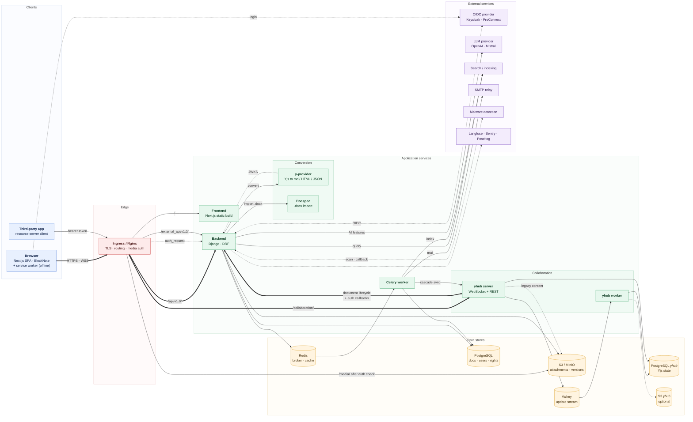
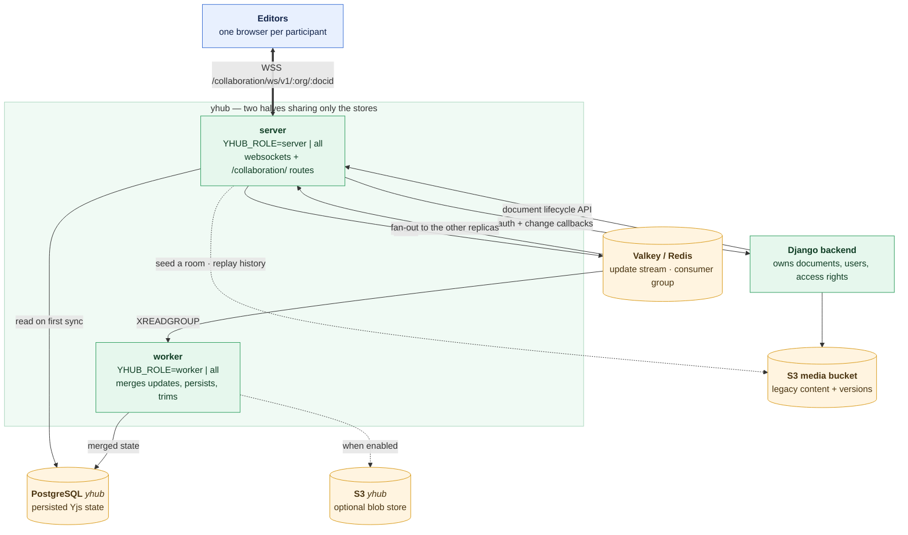
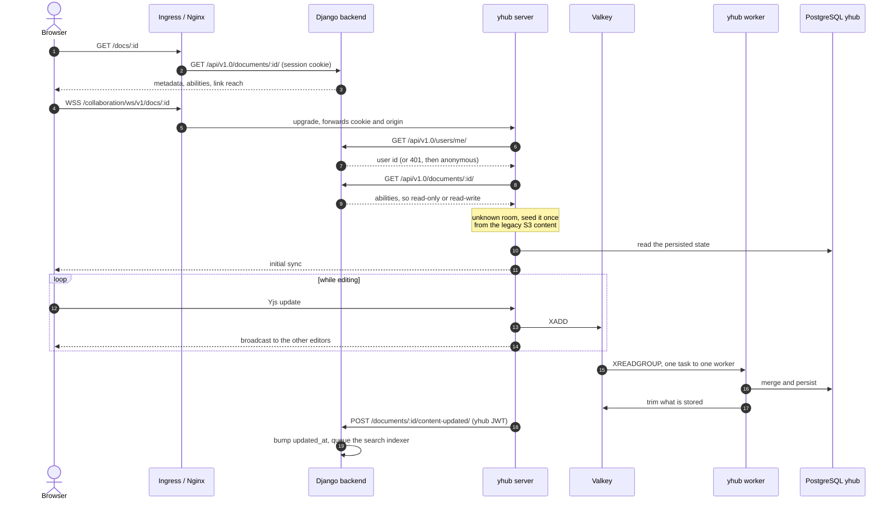
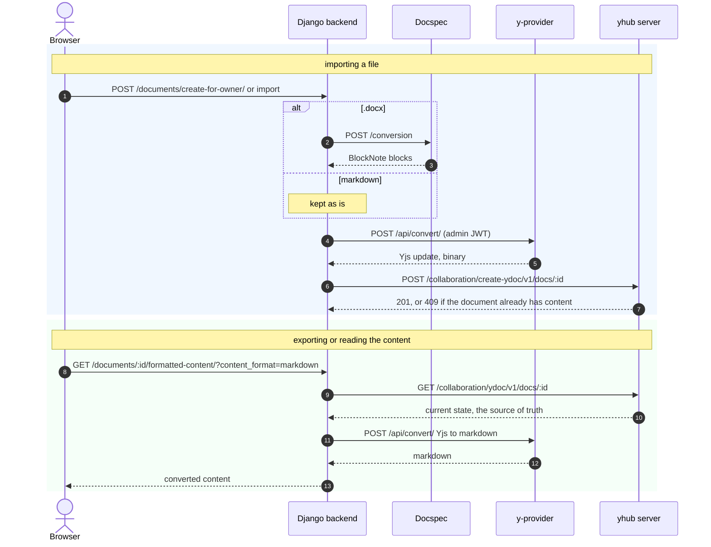
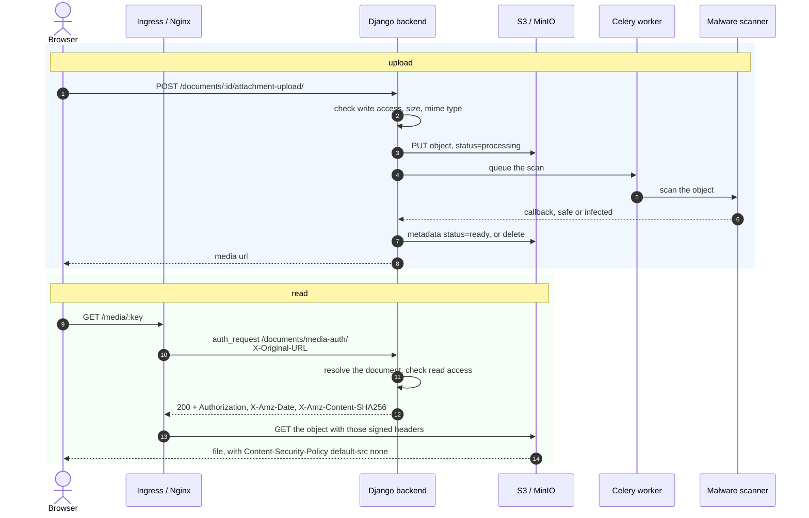
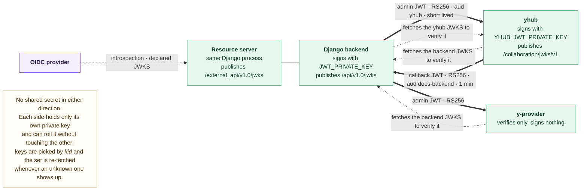

# Architecture

## Overview

Docs is a set of small services around one rule: **Django owns who may do what,
and the collaboration server owns what a document says**. Every other service is
either a client of those two or a converter they call.

- The **backend** (Django) holds documents, users, accesses, invitations and
  attachments metadata. It is the only service that decides whether a caller may
  read or write a document, and every other service asks it rather than deciding
  on its own.
- **yhub** holds the live Yjs state of the documents. Browsers connect to it over
  a websocket and edit together; it persists the merged state in a store of its
  own. The backend reads and writes that state through yhub's REST API — never
  directly in its database.
- The **frontend** is a Next.js application exported to static files. In
  production it is served by Nginx, with no Node.js runtime.
- **y-provider** and **Docspec** are stateless converters. They store nothing and
  own nothing.

Nothing long-lived is shared between the services: they authenticate to each
other with short-lived RS256 JWTs, each verified against the JWKS the other
publishes.

## The services at a glance

| Service | Stack | Owns | Talks to |
| --- | --- | --- | --- |
| Frontend | Next.js, BlockNote, static export served by Nginx | nothing | the browser only |
| Backend | Django, DRF | documents, users, accesses, attachments | PostgreSQL, Redis, S3, yhub, y-provider, Docspec, OIDC, LLM, search |
| Celery worker | Celery | nothing | PostgreSQL, Redis, yhub, SMTP, search |
| yhub server | `@y/hub`, Node | the live document content | Valkey, its PostgreSQL, the backend, S3 |
| yhub worker | `@y/hub`, Node | — | Valkey, its PostgreSQL, optional S3 |
| y-provider | Express, BlockNote server-util | nothing | the backend (JWKS only) |
| Docspec | external image | nothing | nothing |

## Global service map

<!-- diagram: architecture-services -->


## Request routing

One hostname is enough. The reverse proxy dispatches on the path:

| Path | Goes to | Notes |
| --- | --- | --- |
| `/` | frontend | static assets, client-side routing |
| `/api/v1.0/` | backend | REST API, session cookie |
| `/external_api/v1.0/` | backend | resource server, OIDC bearer token |
| `/collaboration/ws/v1/…` | yhub | the websocket the editors open |
| `/collaboration/{ydoc,rollback,prune,changeset,activity,jwks}` | yhub | document APIs, guarded by the same document authorization |
| `/media/` | S3, after an `auth_request` to the backend | see [attachments](#attachments-and-protected-media) |

Four yhub routes are **backend-internal** and must not be published:
`reset-connections`, `migrate`, `restore-ydoc` and `reset-ydoc`. The two probes
(`ping`, `ready`) are called by the kubelet and stay in-cluster too. The helm
chart's ingress lists what it routes rather than what it hides, so they stay
private on their own.

## Collaboration

<!-- diagram: architecture-collaboration -->


yhub is **two halves that share the two stores and nothing else** — no
in-process state, no ordering between them:

- the **server** accepts the websockets, serves the routes, and writes every
  update to the Valkey stream;
- the **worker** claims tasks from that stream, merges the updates, stores the
  result and trims what it persisted.

`YHUB_ROLE` decides which half a process runs. Unset means both, which is the
default. Splitting them lets each scale on its own — servers with the connected
editors, workers with the write throughput — but they are split together or not
at all: servers alone accept edits and never persist them.

Consumer groups hand each task to exactly one worker, and replicas exchange
updates through the stream, so **no sticky routing is needed** on the websocket
ingress and any number of replicas can serve the same document.

yhub decides nothing about access. On every websocket upgrade it asks the
backend twice — `GET /api/v1.0/users/me/` for the identity behind the cookie,
then `GET /api/v1.0/documents/{id}/` for what that identity may do with this
document — and a backend that does not answer produces a retryable 503 rather
than a permission decision. When the persisted content changes, it calls
`POST /api/v1.0/documents/{id}/content-updated/` back, so that lists ordered by
`updated_at` follow the edits. That call is best effort: one the backend refuses
or never receives is logged and dropped.

Documents created before the migration still have their content in the S3 media
bucket. The first access to a room yhub does not know seeds it from there;
`POST /collaboration/migrate/…` replays a document's full version history out of
the same bucket.

See [collaboration.md](collaboration.md) for the configuration.

### Opening and editing a document

<!-- diagram: sequence-open-document -->


## Content is read through yhub, never around it

The backend never reads a document's content from its own database — it does not
have it. Anything needing the text goes through yhub's REST API with an admin
JWT:

| The backend wants to | It calls |
| --- | --- |
| create a document with initial content | `POST /collaboration/create-ydoc/v1/…` — a strict create, 409 if content already exists |
| read the content (export, search indexing, AI) | `GET /collaboration/ydoc/v1/…` |
| delete a document | `DELETE /collaboration/ydoc/v1/…` |
| restore a deleted one | `POST /collaboration/restore-ydoc/v1/…` |
| erase the content, keeping the room | `POST /collaboration/reset-ydoc/v1/…` |
| re-check the rights of connected clients | `POST /collaboration/reset-connections/v1/…` |
| replay the legacy history | `POST /collaboration/migrate/v1/…` |

Deletions and permission changes cascade: a document inherits the accesses of its
ancestors, so the Celery tasks walk the subtree and call the document-scoped
endpoint once per descendant. A document that fails is logged and does not stop
the ones after it.

## Conversion, import and export

<!-- diagram: sequence-conversion -->


**y-provider** is the only service that understands both a Yjs update and the
BlockNote schema, so every conversion in either direction goes through it. It
used to serve the websockets as well, which is why it could be deployed twice;
the collaboration is served by yhub now and the conversion is all that is left.

**Docspec** turns `.docx` into modern editable content. It is optional
(`CONVERSION_UPLOAD_ENABLED`), it exposes a public API with no authentication of
its own, and should therefore be deployed on a private network.

See [format_conversion.md](format_conversion.md).

## Attachments and protected media

<!-- diagram: sequence-attachment -->


Attachments are never served straight from the bucket. Every `/media/` request
goes through an Nginx `auth_request` sub-request to the backend, which resolves
the object key back to its document, checks the caller's read access, and answers
with the S3 headers signing that single object. Nginx then proxies the object
with those headers. The bucket needs no public access, and a leaked url grants
nothing.

The sub-request is on the hot path of every image in a document, so a slow
backend shows up here first — the reason the readiness probe and the database
pool sizing matter more than their traffic suggests.

## Service-to-service trust

<!-- diagram: architecture-trust -->


Both directions between the backend and yhub are authenticated with short-lived
RS256 JWTs, and each side verifies the other against the JWKS it publishes. Both
need a signing key of their own, and neither needs a copy of the other's — so
rolling one needs no change on the other side. The helm chart can generate both
keys into a secret every service mounts read-only (`jwtKeys.enabled`).

Two other credentials exist and are *not* part of that scheme:

- `Y_PROVIDER_API_KEY`, sent by yhub as `X-Y-Provider-Key` on its authorization
  calls. It only exempts them from the API throttling — it authenticates nothing.
- `SERVER_TO_SERVER_API_TOKENS`, a list of bearer tokens accepted on
  `create-for-owner`, for trusted services creating a document on a user's behalf.

## Authentication of the users

The frontend redirects to the OIDC provider (Keycloak in development, ProConnect
in production, any compliant provider elsewhere); the backend is the relying
party and keeps the session in a cookie. That cookie is what the browser sends to
the API *and* what yhub forwards to the backend when authorizing a websocket.

Docs is also a **resource server**: with `OIDC_RESOURCE_SERVER_ENABLED`, another
application can call `/external_api/v1.0/` with an OIDC access token, on the
routes and actions the `EXTERNAL_API` setting allows. See
[resource_server.md](resource_server.md).

## Asynchronous work

Celery runs on the same Redis instance the backend caches and stores sessions in,
on a database of its own. It carries what must not
block a request: invitation and access-request emails, the search indexing, the
user reconciliation import, the malware scan callbacks, and the cascade calls to
yhub when a document is deleted, restored, or has its accesses changed. There is
no beat scheduler — periodic work is deployed as Kubernetes CronJobs
(`backend.cronjobs` in the chart).

## Optional and external services

| Service | Enabled by | Used for |
| --- | --- | --- |
| Search / indexing | `SEARCH_INDEXER_CLASS`, `INDEXING_URL`, `SEARCH_URL` | full-text search across documents, fed by Celery |
| LLM provider | `AI_FEATURE_ENABLED` + OpenAI-compatible or Mistral credentials | rewrite, summarize, translate, fix typos |
| Langfuse | `LANGFUSE_*` | tracing the LLM calls |
| Malware detection | `MALWARE_DETECTION` backend | scanning uploaded attachments |
| Docspec | `CONVERSION_UPLOAD_ENABLED`, `DOCSPEC_API_URL` | `.docx` import |
| yhub S3 persistence | `YHUB_S3_PERSISTENCE` | document blobs in a bucket instead of PostgreSQL |
| Sentry, PostHog | `SENTRY_DSN`, `POSTHOG_KEY` | errors and product analytics |

## Data stores

| Store | Holds | Lost if deleted |
| --- | --- | --- |
| PostgreSQL (Django) | documents, users, accesses, invitations | everything but the document text |
| Redis | Celery broker, cache, sessions | in-flight tasks, and every session — users are logged out |
| S3 / MinIO | attachments, legacy content and its version history | attachments, version history |
| Valkey / Redis (yhub) | the update stream not yet persisted | the last seconds of edits — hence `appendonly` |
| PostgreSQL (yhub) | the persisted Yjs state | the documents' text |
| S3 (yhub, optional) | the same state as blobs | the documents' text |

yhub's schema is never created at startup — the server runs no DDL. Run its init
script once before starting it, and again after every upgrade that adds a table;
the helm chart runs it as a job.

## Regenerating the diagrams

The diagrams above are the source. `documentation/assets/diagrams/render.sh`
extracts each one into a standalone `.mmd` file and renders it to PNG and SVG in
the same directory:

```bash
./documentation/assets/diagrams/render.sh
```

## Architecture decision records

- [ADR-0001-20250106-use-yjs-for-docs-editing](./adr/ADR-0001-20250106-use-yjs-for-docs-editing.md)
