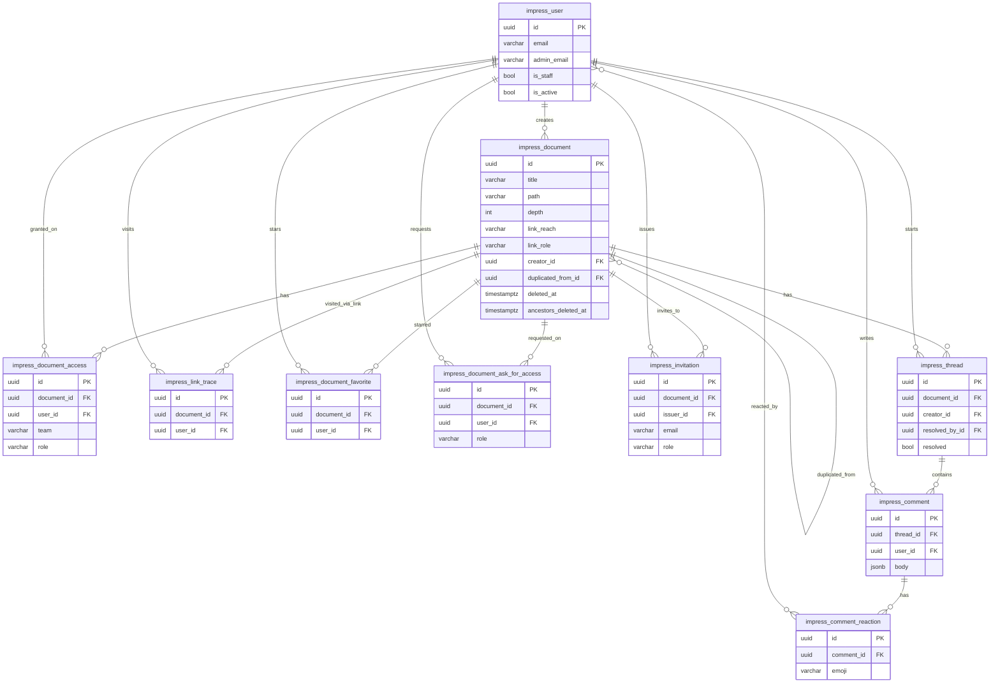

# Database schema description 

Docs uses a PostgreSQL database used by a Django app (app label `core`,
project `impress`). All app tables are prefixed `impress_`.

## Entity-relationship diagram

Core relations (the `impress_user_reconciliation*` admin/ops tables are omitted
here for clarity — they just hold two nullable FKs to `impress_user`, see below).

Note: `impress_document`'s self-relationship shown above (`duplicated_from`) is a
real FK, but the tree parent/child structure is **not** a FK at all — it's encoded
in the `path` column (materialized path), so no line for "parent document" appears
in this diagram even though the hierarchy is central to how documents work (see
below).

## Global conventions

- Every app table has: `id UUID PRIMARY KEY` (random uuid4, not sequential),
  `created_at TIMESTAMPTZ`, `updated_at TIMESTAMPTZ`.
- Foreign keys are UUIDs referencing the `id` of the target table.
- Enum-like fields are plain `varchar` with values constrained at the application
  layer (Django `TextChoices`), not by a Postgres `CHECK`/`ENUM` type unless noted.
- **Document body/text content is NOT stored in Postgres.** `Document` rows hold
  metadata only; the actual rich-text/markdown content lives in S3-compatible
  object storage keyed by `{document_id}/file`. Don't expect to grep document text
  via SQL.
- Besides the app tables below, the database also has standard Django/library
  tables you'll rarely need: `django_migrations`, `django_session`, `django_site`,
  `django_content_type`, `auth_permission`, `auth_group`, `auth_group_permissions`,
  `impress_user_groups`, `impress_user_user_permissions`, `waffle_*` (feature
  flags), `django_admin_log`. Ignore these unless a query is specifically about
  permissions/flags/sessions.

## Enums (application-level, stored as text)

**role** (`RoleChoices`) — ordered from least to most privileged, used on
`impress_document_access`, `impress_document_ask_for_access`, `impress_invitation`:
`reader` < `commenter` < `editor` < `administrator` < `owner`.

**link_reach** (`LinkReachChoices`), on `impress_document.link_reach`:
`restricted` (only users with explicit access) < `authenticated` (any logged-in
user) < `public` (anyone, incl. anonymous).

**link_role** (`LinkRoleChoices`), on `impress_document.link_role` — the role
granted to whoever satisfies `link_reach`: `reader` < `commenter` < `editor`.

## Tables

### `impress_user`
One row per human/service user (OIDC-based auth, no local passwords).
- `sub` (varchar, unique, nullable) — OIDC subject identifier.
- `full_name`, `short_name` (varchar, nullable)
- `email` (varchar, nullable) — identity email from the OIDC token.
- `admin_email` (varchar, unique, nullable) — separate email used for Django admin login.
- `language`, `timezone` (varchar)
- `is_device` (bool) — true for machine/device accounts rather than real users.
- `is_staff`, `is_active`, `is_superuser` (bool)
- `is_first_connection` (bool) — onboarding flag.

### `impress_document`
The core object: a page/pad in a folder-like tree (django-treebeard **materialized
path**, not adjacency-list/recursive CTE).
- `title` (varchar, nullable), `excerpt` (varchar 300, nullable)
- `link_reach`, `link_role` — see enums above; this is the document's *own* link
  setting, not necessarily what applies (see "Permission model" below).
- `creator_id` → `impress_user.id` (nullable, `ON DELETE SET NULL`-like via app logic)
- `deleted_at` (timestamptz, nullable) — soft-delete marker on the document itself.
- `ancestors_deleted_at` (timestamptz, nullable) — set when this doc or *any*
  ancestor was soft-deleted; `deleted_at IS NULL AND ancestors_deleted_at IS NOT NULL`
  means "deleted because a parent was deleted", not deleted directly.
- `has_deleted_children` (bool)
- `duplicated_from_id` → `impress_document.id` (nullable, self-FK, `SET NULL`)
- `attachments` (text[] — Postgres array of file keys)
- Tree columns from django-treebeard (materialized path, base-62-ish alphabet, 7
  chars per path segment):
  - `path` (varchar(252), **unique**, C-collation) — e.g. a child of `path='0000001'`
    is something like `path='00000010000001'`. **Ancestors of a row are found by
    prefix-matching `path`**: `WHERE document.path = LEFT(:child_path, LENGTH(document.path))`
    or, for all ancestors of a node with path `p`: rows whose path is a prefix of `p`.
    Descendants: `WHERE path LIKE p || '%'` (excluding `p` itself for strict descendants).
  - `depth` (int) — 1 = root document.
  - `numchild` (int) — number of *non-deleted* direct children.

A row with `depth = 1` is a "workspace root" document (no parent).

### `impress_document_access`
Grants a `role` on a document to either a user OR a team (never both, never
neither — enforced by a CHECK constraint).
- `document_id` → `impress_document.id`
- `user_id` → `impress_user.id` (nullable)
- `team` (varchar, blank if unused) — an external team identifier string, not an FK
  (teams aren't modeled as a table here; they come from the identity provider).
- `role` — see role enum.
- Unique on `(user_id, document_id)` when `user_id IS NOT NULL`, and unique on
  `(team, document_id)` when `team != ''`.

**Permission model / access inheritance**: a user's effective role on a document
is the MAX (by priority) of:
1. Roles granted directly on that document via `impress_document_access`, and
2. Roles granted on any of its *ancestors* (same table, matched via the `path`
   prefix trick above), and
3. The role implied by `link_reach`/`link_role` if the effective `link_reach`
   (own or inherited from ancestors, taking the most permissive) allows it.

So "who can access document X" is never a single-table query — it requires
walking ancestors by path prefix.

### `impress_link_trace`
Records that a given user has visited a document via a share link (used so it
shows up in their "shared with me" list even without an explicit access row).
- `document_id`, `user_id` — unique together.

### `impress_document_favorite`
User-starred documents. `document_id`, `user_id` — unique together.

### `impress_document_ask_for_access`
A pending request from a user to be granted access to a document.
- `document_id`, `user_id` (unique together), `role` (requested role).

### `impress_invitation`
A pending invite by email (for people without an account yet) to get a role on
a document once they sign up.
- `email` (varchar), `document_id`, `role`, `issuer_id` → `impress_user.id`.
- Unique on `(email, document_id)`.
- Time-limited (`INVITATION_VALIDITY_DURATION` setting); expired invitations are
  effectively ignored by the app even though the row remains until cleanup.

### `impress_thread`
A comment thread anchored to a document.
- `document_id` → `impress_document.id`
- `creator_id` → `impress_user.id` (nullable, `SET NULL`)
- `resolved` (bool), `resolved_at` (timestamptz, nullable), `resolved_by_id` →
  `impress_user.id` (nullable)
- `metadata` (jsonb)

### `impress_comment`
A single comment within a thread.
- `thread_id` → `impress_thread.id`
- `user_id` → `impress_user.id` (nullable, `SET NULL`, i.e. author may be gone)
- `body` (jsonb) — rich text body of the comment (this one IS stored in Postgres,
  unlike document content).
- `metadata` (jsonb)

### `impress_comment_reaction`
One row per (comment, emoji) pair; the set of users who reacted with that emoji
is a many-to-many.
- `comment_id` → `impress_comment.id`
- `emoji` (varchar)
- Unique on `(comment_id, emoji)`.
- M2M join table **`impress_comment_reaction_users`** with columns
  `reaction_id` → `impress_comment_reaction.id` and `user_id` → `impress_user.id`
  (standard Django auto-generated M2M table, also has its own `id` PK).

### `impress_user_reconciliation`
Admin/ops tool for merging two user accounts (e.g. after an email change).
- `active_email`, `inactive_email` (varchar)
- `active_email_checked`, `inactive_email_checked` (bool)
- `active_user_id`, `inactive_user_id` → `impress_user.id` (nullable)
- `active_email_confirmation_id`, `inactive_email_confirmation_id` (uuid, unique)
- `source_unique_id` (varchar, nullable)
- `status` (varchar: `pending` | `ready` | `done` | `error`)
- `logs` (text)

### `impress_user_reconciliation_csv_import`
Batch import job for the above.
- `file` (varchar — storage path)
- `status` (varchar: `pending` | `running` | `done` | `error`)
- `logs` (text)

## Common query gotchas

- **Never** join on `path` with `=`; it's a materialized-path prefix scheme, so
  ancestor/descendant lookups need prefix matching (`LEFT()`, `LIKE`, or
  `starts_with()`), not equality, except when matching the exact same node.
- To list a document's ancestors including itself: rows whose `path` is a prefix
  of the target's `path` (i.e. `target.path` starts with `candidate.path`), among
  rows with `ancestors_deleted_at IS NULL`.
- To list descendants: `path LIKE (target_path || '%')`.
- "Is this document visible/deleted" needs both `deleted_at` (deleted directly)
  and `ancestors_deleted_at` (deleted via an ancestor) — a document can be
  non-null on the latter without being null on the former.
- Role comparisons are by priority order, not alphabetically:
  `reader(1) < commenter(2) < editor(3) < administrator(4) < owner(5)`.
- `impress_document_access.user_id` and `.team` are mutually exclusive — don't
  assume `user_id` is always populated.
- Document body text is not in Postgres at all — don't attempt full-text SQL
  search over document content; only `title`/`excerpt` are queryable that way.
