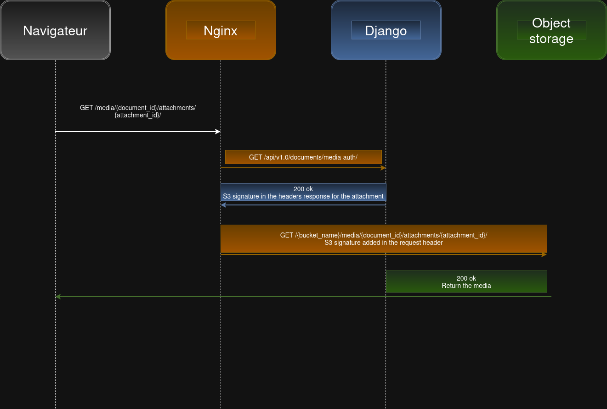

# How object storage is used

Object storage is a cornerstone in Docs architecture. We save in it all the Docs content but also all the media uploaded.

All object storage compatible with the S3 API and the versionning feature can be used with docs. The S3 python SDK is used by the project to communicate with the object storage.

The object storage is never directly exposed, the bucket created must be private and docs should have access to it.

To upload an object, this one is in a first time uploaded to the django backend and then copy in the object storage. This is one of the reason
a media is by default limited to 10 MB.

Configuration becomes "harder" when you want to access those uploaded media.

## Media access architecture

To access securely an uploaded object, we use the [auth_request](https://nginx.org/en/docs/http/ngx_http_auth_request_module.html) Nginx module. This module will delegate the authentication to a subrequest. If the subrequest returns a 2xx status code, the request is allowed. If it returns 401 or 403, the access is denied with the corresponding error code. Any other response code returned by the subrequest is considered an error.

In our architecture, the subrequest is made to the Django application. The subrequest contains the user cookie session allowing the Django application to determine if the current user has access or not to the Docs and so to the uploaded object.

When the subrequest returns a 2xx status code, it also contains in its headers the S3 policy allowing the access to the object.
Nginx will use these headers and proxy pass them to the object storage.

To understand how media access is working, this network diagram show all the stream



A complete [Nginx configuration](../docker/files/etc/nginx/conf.d/default.conf) used by the docker compose development stack can be read to understand the configuration needed

## Known issues

Depending the Object Sorage used, the complete configuration can differ a little bit.

### With django

The S3 python SDK, named [Boto3](https://github.com/boto/boto3/), is used by Docs.
Since version 1.36.0, they changed the [Data Integrity Protections](https://docs.aws.amazon.com/sdkref/latest/guide/feature-dataintegrity.html) by enabling it by default.
Some Object Storage implemenation are not compatible with this change and can lead to signature mismatch error or other errors related to the signature.

To fix this issue, two environment variable can be used to have the older default behavior: 

```
AWS_REQUEST_CHECKSUM_CALCULATION=when_required
AWS_RESPONSE_CHECKSUM_VALIDATION=when_required
```

### With the Ingress-Nginx

With the ingress-nginx there are also some know issues when you configure the ingress media. Some other annotations should be used depending your setup.

By default, Nginx use the HTTP backend protocol, change it to HTTPS if your object storage API is exposed to internet using a ssl certificate.

```
nginx.ingress.kubernetes.io/backend-protocol: "HTTPS"
```

Sometimes the global ingress configuration set to `false` settings related to ssl redirection when TLS is enabled on the ingress.
You should change this behvior using these [annotations](https://github.com/kubernetes/ingress-nginx/blob/main/docs/user-guide/nginx-configuration/annotations.md#server-side-https-enforcement-through-redirect)

```
nginx.ingress.kubernetes.io/force-ssl-redirect: "true"
nginx.ingress.kubernetes.io/ssl-redirect: "true"
```

To finish, you have to understand correctly the annotation `nginx.ingress.kubernetes.io/rewrite-target`. This annotation is used to proxy pass the request to the object storage when the subrequest is successfully issued. The purpose of this rewriting is to add the bucket name at the beginning of the proxied url. So your annotation should be: 

```
nginx.ingress.kubernetes.io/rewrite-target: /{bucket_name}/$1
```
